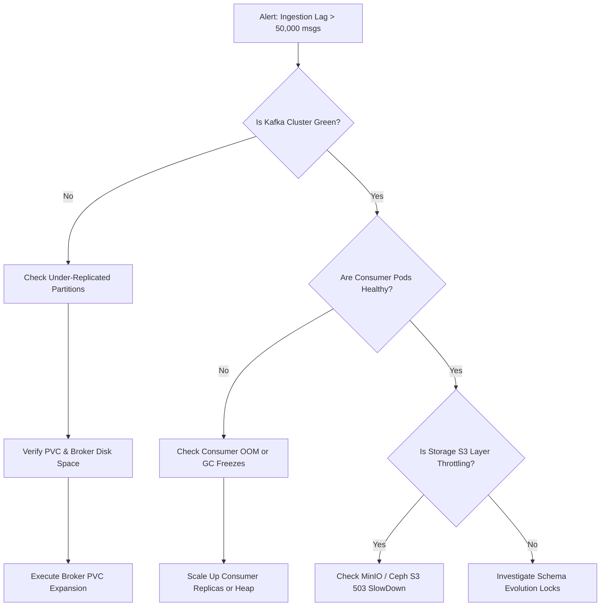

# Operational Runbook: Triaging Lakehouse Ingestion Lag

- **Runbook ID**: RB-LAKEHOUSE-001
- **Target Substrates**: Strimzi Kafka, Spark Streaming, MinIO / Ceph S3 Store
- **Severity Level**: Priority 1 / Priority 2

---

## 1. Quick Diagnostic Checklist

```console
# Step 1: Check fleetwide Kafka consumer lag
$ kubectl exec -it fleet-kafka-cluster-kafka-0 -n lakehouse-infra --     bin/kafka-consumer-groups.sh --bootstrap-server localhost:9092 --describe --group lakehouse-iceberg-sink-group

# Step 2: Query Prometheus consumer lag golden signal
# PromQL: sum(kafka_consumergroup_lag{topic=~"lakehouse-.*"}) by (consumergroup, topic)
```

---

## 2. Decision Tree & Triage Workflow



---

## 3. Detailed Triage Steps

### Step 3.1: Identifying Slow Consumer Partitions
Execute the following PromQL in the Grafana Cockpit:
```promql
topk(5, sum by (partition, topic) (kafka_consumergroup_lag{topic=~"lakehouse-.*"}))
```
If lag is isolated to a single partition, verify whether the key distribution has a hotspot or if the specific partition consumer pod is stuck in GC pause.

### Step 3.2: Inspecting Under-Replicated Partitions
```console
$ kubectl exec -n lakehouse-infra fleet-kafka-cluster-kafka-0 -c kafka --     bin/kafka-topics.sh --bootstrap-server localhost:9092 --describe --under-replicated-partitions
```
If under-replicated partitions exist:
1. Verify broker disk usage: `kubectl exec -n lakehouse-infra fleet-kafka-cluster-kafka-0 -- df -h /var/lib/kafka/data`
2. Check broker logs for I/O errors: `kubectl logs -n lakehouse-infra -l app.kubernetes.io/name=kafka --tail=100 | grep -E "IOException|Disk full"`

### Step 3.3: Remediation & Scaling
To temporarily scale ingestion consumers to drain queue lag:
```console
$ kubectl scale deployment lakehouse-ingest-consumer -n lakehouse-compute --replicas=12
```
Verify consumer group rebalance completes cleanly:
```console
$ kubectl logs -n lakehouse-compute -l app=lakehouse-ingest-consumer --tail=50 | grep "Successfully joined group"
```
