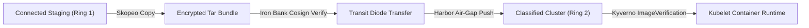

# Operational Runbook: Air-Gapped / Disconnected Registry Mirroring

- **Runbook ID**: RB-AIRGAP-003
- **Target Substrates**: DoD Platform One / Iron Bank, Harbor Private Registry, Skopeo, Crane, Cosign
- **Classification / Rings**: Ring 2 (Air-Gapped & Sovereign Classified Enclaves)
- **Severity Level**: Standard Operations / Release Deployment

---

## 1. Overview & Security Guardrails
Air-gapped clusters (`site26` through `site50`) have no direct outbound Internet connectivity. All container images, Helm charts, and synthetic test harness bundles must be cryptographically signed, scanned for CVEs via Iron Bank VAT (Vulnerability Assessment Tool), exported to physical media or secure transit diode, and mirrored into local cluster Harbor registries.

---

## 2. Image Synchronization Workflow



---

## 3. Execution Commands

### Step 3.1: Exporting Images with Skopeo & Cryptographic Digest Capture
```console
$ cat <<EOF > image-manifest.txt
registry1.dso.mil/ironbank/opensource/trino/trino:435
registry1.dso.mil/ironbank/strimzi/kafka:0.39.0-kafka-3.6.1
registry1.dso.mil/ironbank/projectnessie/nessie:0.77.0
EOF

# Sync images to local archive directory
$ while read img; do
    echo "[*] Pulling and verifying digest for $img..."
    skopeo copy --all docker://$img dir:/opt/airgap/images/$(basename $img)
  done < image-manifest.txt
```

### Step 3.2: Verify Cosign Signature with Platform One Public Key
```console
$ cosign verify --key /etc/pki/platform-one-pubkey.pem     registry1.dso.mil/ironbank/opensource/trino/trino:435
```

### Step 3.3: Ingest Images into Disconnected Local Harbor Registry
```console
$ TARGET_REGISTRY="harbor.airgap.site42.mil"
$ while read img; do
    DEST_TAG="${TARGET_REGISTRY}/ironbank/$(basename $img)"
    echo "[*] Ingesting to local harbor: $DEST_TAG"
    skopeo copy --all dir:/opt/airgap/images/$(basename $img) docker://$DEST_TAG       --dest-tls-verify=false
  done < image-manifest.txt
```

### Step 3.4: Verify Image Signature in Air-Gap
```console
$ crane digest harbor.airgap.site42.mil/ironbank/trino:435
sha256:8b4f1293a9c720e74f1b88e0b6df4513a0c5f949c30e71ab87208dbe15433018
```
